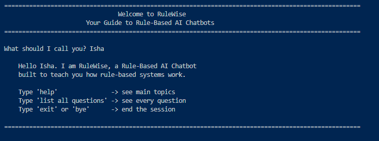
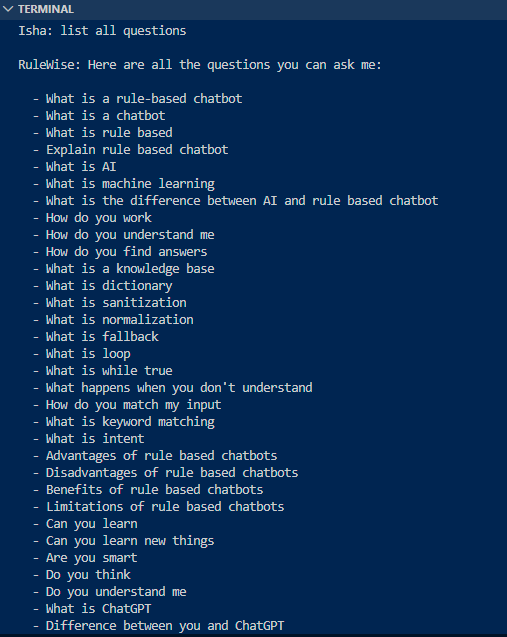
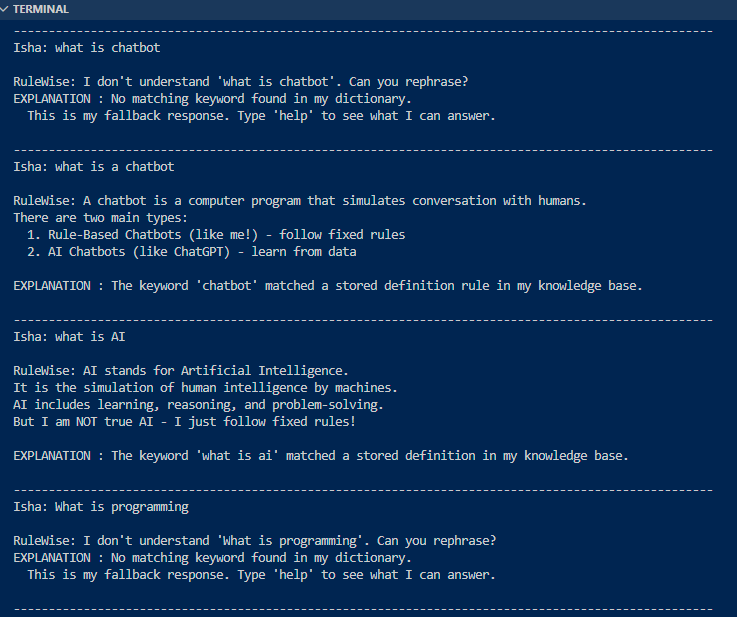
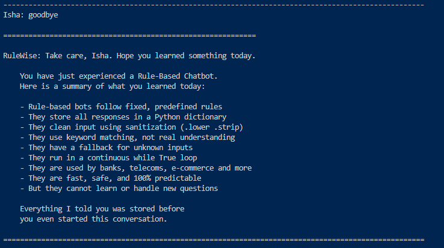

# RuleWise

A rule-based AI chatbot built in Python that teaches users how rule-based systems work by being a live, working example of one. Every response includes an explanation of how and why the bot responded that way.

---

## Preview

### Welcome Screen


### Full Question List


### Responses with Explanations


### Exit Summary


---

## Getting Started

No external libraries required. Pure Python only.

```
python RuleWise.py
```

---

## How It Works

Every message goes through a 6-step process:

```
1. Take user input
2. Sanitize  ->  .lower().strip()
3. Check for exit keyword  ->  break if found
4. Check for empty input   ->  prompt again
5. Search dictionary for matching keyword
6. Return stored response or fallback
```

---

## Project Structure

```
RuleWise.py
│
├── responses {}          ->  knowledge base dictionary
├── EXIT_KEYWORDS         ->  words that end the program
├── farewell_messages {}  ->  personalized goodbye messages
├── EXIT_SUMMARY          ->  learning summary shown on exit
│
├── display_response()    ->  prints reply and explanation
├── find_match()          ->  searches dictionary for keyword
├── exit_handler()        ->  handles goodbye and summary
├── get_name()            ->  welcome screen and name input
├── show_welcome()        ->  shows instructions after name
└── main()                ->  runs the full chatbot loop
```

---

## Topics Covered

| Category | Keywords |
|---|---|
| Core Concepts | what is a rule based chatbot, what is a chatbot, explain rule based chatbot |
| AI Concepts | what is ai, what is machine learning, what is chatgpt |
| How It Works | how do you work, how do you match my input, how do you find answers |
| Technical | sanitization, normalization, fallback, loop, dictionary, intent |
| Advantages | advantages, benefits of rule based chatbots |
| Disadvantages | disadvantages, limitations of rule based chatbots |
| Company Usage | do companies use rule based chatbots |
| Intelligence | can you learn, are you smart, do you think, are you alive |

---

## Key Concepts

**Sanitization**
```python
clean_input = raw_input_text.lower().strip()
```

**Dictionary Lookup**
```python
def find_match(clean_input):
    if clean_input in responses:
        return clean_input
    for key in responses:
        if key in clean_input:
            return key
    return None
```

**Fallback**
```python
if matched_key:
    display_response(matched_key, name)
else:
    print("I don't understand. Can you rephrase?")
```

**Exit Strategy**
```python
EXIT_KEYWORDS = ("exit", "quit", "close", "stop", "bye", "goodbye", "farewell", "see you", "q")

if clean_input in EXIT_KEYWORDS:
    exit_handler(clean_input, name)
    break
```

---

Built by **Isha Javed**
