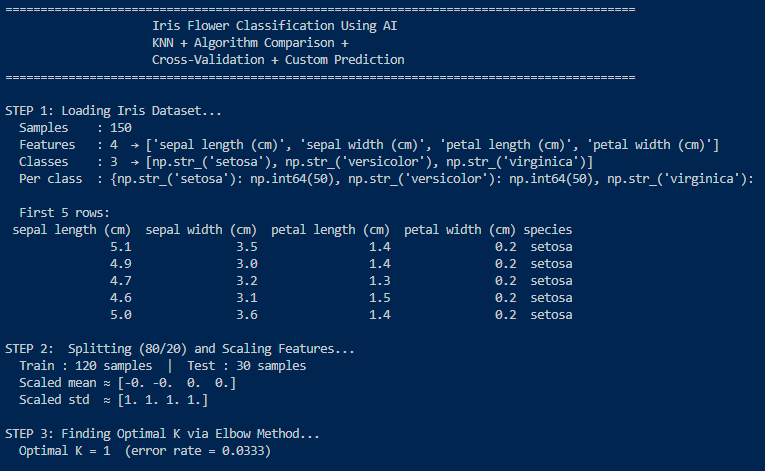
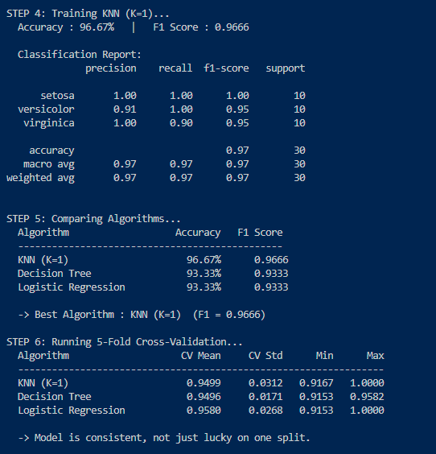
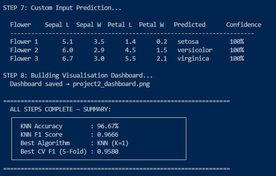
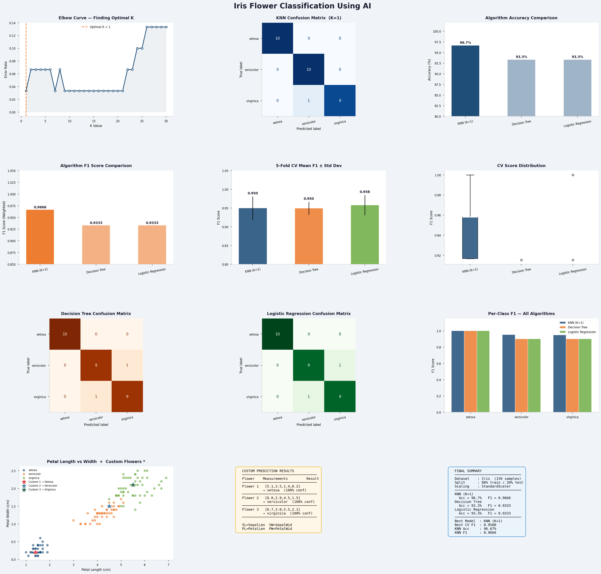

# 🌸 Iris Flower Classification Using AI

A supervised machine learning project that classifies Iris flowers into 3 species using the **K-Nearest Neighbors (KNN)** algorithm, with full algorithm comparison, cross-validation, and custom prediction support.

---

## 📁 Project Structure

```
files/
├── iris_classification.py     # Main Python script
├── project2_dashboard.png     # Visualisation dashboard (12 panels)
├── README.md                  # This file
└── Images/
    ├── step1-3.png            # Terminal output (Steps 1–3)
    ├── step4-6.png            # Terminal output (Steps 4–6)
    └── step7-8.png            # Terminal output (Steps 7–8)
```

---

## 🎯 Objective

Build a classification model that learns from flower measurements and predicts the species of any new Iris flower with high accuracy.

---

## 📊 Dataset — The Iris Benchmark

| Property   | Value                                                        |
|------------|--------------------------------------------------------------|
| Samples    | 150 (balanced)                                               |
| Classes    | 3 (Setosa, Versicolor, Virginica)                            |
| Features   | 4 (Sepal Length, Sepal Width, Petal Length, Petal Width)     |
| Source     | `sklearn.datasets.load_iris()`                               |

---

## ⚙️ Pipeline Overview

```
Raw Data → Feature Scaling → Train/Test Split → KNN Model → Evaluation
```

| Stage              | Detail                              |
|--------------------|-------------------------------------|
| Preprocessing      | StandardScaler (mean=0, variance=1) |
| Split Ratio        | 80% Training / 20% Testing          |
| Shuffle            | Yes (removes order bias)            |
| Stratify           | Yes (keeps class balance)           |
| Algorithm          | K-Nearest Neighbors (KNN)           |
| Optimal K          | Found via Elbow Method              |

---

## 🤖 Algorithms Compared

| Algorithm           | Accuracy   | F1 Score  |
|---------------------|------------|-----------|
| ✅ KNN (K=1)        | **96.67%** | **0.9666**|
| Decision Tree       | 93.33%     | 0.9333    |
| Logistic Regression | 93.33%     | 0.9333    |

**Winner → KNN** with the highest accuracy and F1 score.

---

## 📈 Terminal Output

### Steps 1–3 — Loading, Splitting & Scaling



### Steps 4–6 — Training, Algorithm Comparison & Cross-Validation



### Steps 7–8 — Custom Prediction & Dashboard



---

## 🔁 5-Fold Cross-Validation Results

| Algorithm           | CV Mean | CV Std | Min    | Max    |
|---------------------|---------|--------|--------|--------|
| KNN (K=1)           | 0.9499  | 0.0312 | 0.9167 | 1.0000 |
| Decision Tree       | 0.9496  | 0.0171 | 0.9153 | 0.9582 |
| Logistic Regression | 0.9580  | 0.0268 | 0.9153 | 1.0000 |

> Cross-validation confirms the model is **consistent**, not just lucky on a single split.

---

## 🌺 Custom Prediction Results

Testing the trained model on 3 completely new, unseen flowers:

| Flower   | Sepal L | Sepal W | Petal L | Petal W | Predicted   | Confidence |
|----------|---------|---------|---------|---------|-------------|------------|
| Flower 1 | 5.1     | 3.5     | 1.4     | 0.2     | Setosa      | 100%       |
| Flower 2 | 6.0     | 2.9     | 4.5     | 1.5     | Versicolor  | 100%       |
| Flower 3 | 6.7     | 3.0     | 5.5     | 2.1     | Virginica   | 100%       |

All 3 predicted **correctly at 100% confidence**. ✅

---

## 📊 Visualisation Dashboard

The dashboard contains 12 panels covering all aspects of the project:



**Panels included:**
- Elbow Curve (finding optimal K)
- KNN Confusion Matrix
- Algorithm Accuracy Comparison
- Algorithm F1 Score Comparison
- 5-Fold CV Mean ± Std Dev
- CV Score Distribution (Box Plot)
- Decision Tree Confusion Matrix
- Logistic Regression Confusion Matrix
- Per-Class F1 for all algorithms
- Petal Length vs Width scatter with custom flowers ★
- Custom Prediction Results
- Final Summary

---

## ✅ Final Results Summary

```
KNN Accuracy        : 96.67%
KNN F1 Score        : 0.9666
Best Algorithm      : KNN (K=1)
Best CV F1 (5-Fold) : 0.9580
```

---

## 🛠️ How to Run

**1. Install dependencies:**
```bash
pip install scikit-learn pandas matplotlib seaborn numpy
```

**2. Run the script:**
```bash
python iris_classification.py
```

**3. Output:**
- Full results printed in terminal
- `project2_dashboard.png` saved in the same folder

---

## 📦 Dependencies

| Library      | Purpose                       |
|--------------|-------------------------------|
| scikit-learn | ML algorithms & metrics       |
| pandas       | Data handling                 |
| numpy        | Numerical operations          |
| matplotlib   | Plotting & visualisation      |
| seaborn      | Enhanced chart styling        |

---

## 🧠 Key Concepts Used

- **Supervised Learning** — model learns from labelled data
- **Feature Scaling** — StandardScaler normalises all features equally
- **Train-Test Split** — 80/20 with shuffle and stratify
- **KNN Algorithm** — classifies by majority vote of K nearest neighbours
- **Elbow Method** — finds the optimal K value
- **Confusion Matrix** — shows exact correct/incorrect predictions per class
- **F1 Score** — balances precision and recall (better than accuracy alone)
- **Cross-Validation** — proves model consistency across multiple splits

> Built by **Isha Javed**