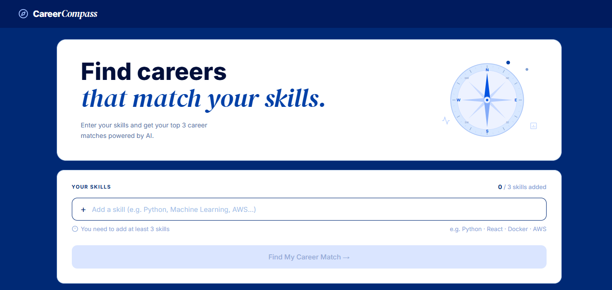
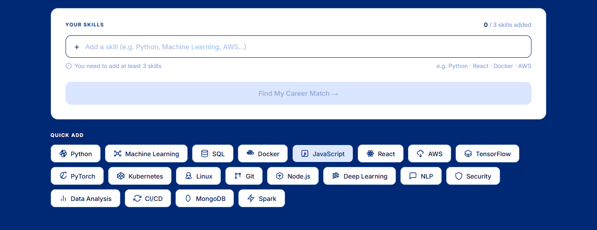
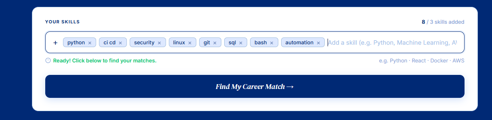
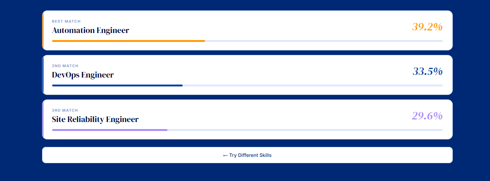

# 🧭 Career Compass

> An AI-powered career recommendation engine that matches your skills to the most relevant job roles using TF-IDF vectorization and Cosine Similarity.

---

## 📸 Preview

### Hero



### Skills Input (with selected skills)


### Results


---

## ✨ Features

- 🔍 **Content-Based Filtering** — matches your skills against 20 real job roles
- 📐 **TF-IDF + Cosine Similarity** — industry-standard NLP ranking algorithm
- ⚡ **No database, no login** — runs entirely from a CSV file
- 🎨 **Clean modern UI** — responsive design with blue & white theme
- 🚀 **Zero dependencies** — built with Python standard library only

---

## 🗂️ Project Structure

```
Task-3-Isha_Javed/
├── career_compass/
│   ├── app.py            # Python HTTP server + recommendation engine
│   ├── index.html        # Frontend UI (single file)
│   └── raw_skills.csv    # Dataset — 20 job roles with skill sets
├── images/
│   ├── hero1.png
│   ├── hero2.png
│   ├── skills.png
│   └── results.png
└── README.md
```

---

## 🚀 Getting Started

### 1. Clone the repository

```bash
git clone https://github.com/YOUR_USERNAME/Task-3-Isha_Javed.git
cd Task-3-Isha_Javed/career_compass
```

### 2. Run the server

```bash
python app.py
```

### 3. Open in browser

```
http://localhost:5000
```

The app will open automatically in your default browser.

---

## 🧠 How It Works

1. **You enter skills** (e.g. `python`, `machine_learning`, `docker`)
2. **TF-IDF vectors** are computed for your skills and every job role in the dataset
3. **Cosine Similarity** scores are calculated between your vector and each role
4. **Top 3 matches** are returned ranked by similarity score

```
User Skills → TF-IDF Vector → Cosine Similarity → Top 3 Roles
```

---

## 📊 Dataset

The `raw_skills.csv` contains **20 job roles** including:

| Role | Example Skills |
|---|---|
| Data Scientist | python, machine_learning, statistics, sql |
| Frontend Developer | javascript, react, css, typescript |
| DevOps Engineer | docker, kubernetes, aws, ci_cd |
| NLP Engineer | python, nlp, transformers, pytorch |
| Cybersecurity Analyst | networking, security, ethical_hacking |
| ... | ... |

---

## 🌐 Deploying for Free

### Render (Recommended)
1. Push this repo to GitHub
2. Go to [render.com](https://render.com) → New Web Service
3. Connect your repo
4. Set **Start Command** to `python app.py`
5. Deploy — it's live!

### Railway
1. Go to [railway.app](https://railway.app)
2. New Project → Deploy from GitHub repo
3. Set start command to `python app.py`

### PythonAnywhere
1. Go to [pythonanywhere.com](https://pythonanywhere.com)
2. Upload files via the Files tab
3. Set up a web app pointing to `app.py`

---

## 📁 Adding Your Own Images

Place images in the `images/` folder at the root and reference them in `index.html`:

```html

```

---

## 🛠️ Built With

- **Python 3** — standard library only (`http.server`, `csv`, `math`, `json`)
- **HTML / CSS / JavaScript** — single-file frontend
- **TF-IDF** — Term Frequency-Inverse Document Frequency
- **Cosine Similarity** — vector similarity scoring

---

## 📄 License

MIT License — free to use, modify, and distribute.

---

**Built by Isha Javed**
