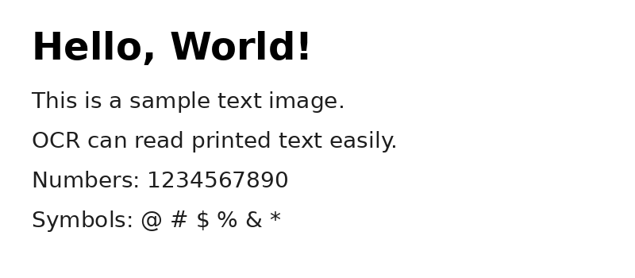
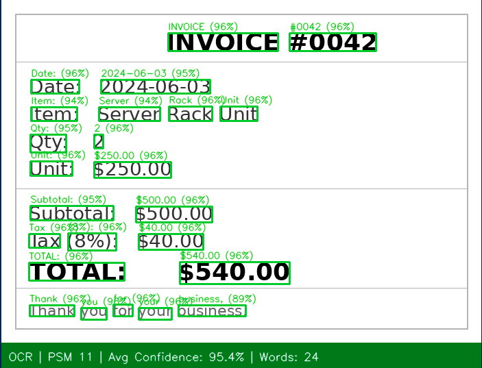
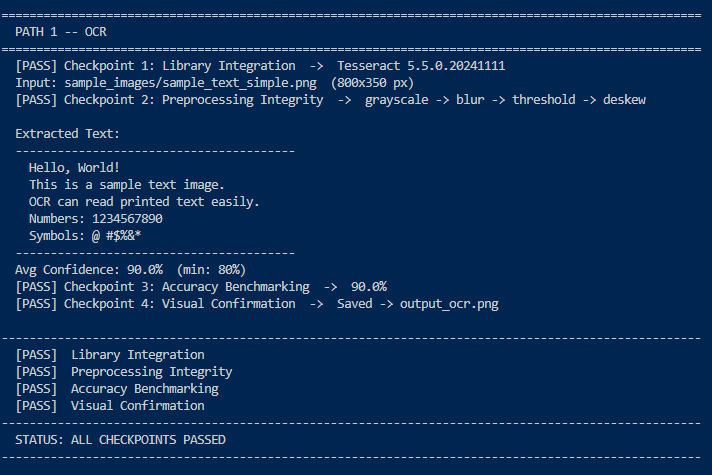
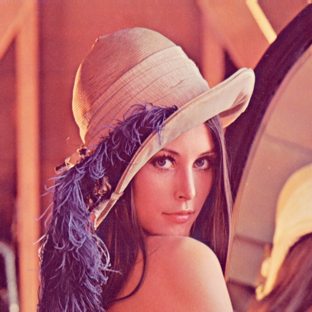
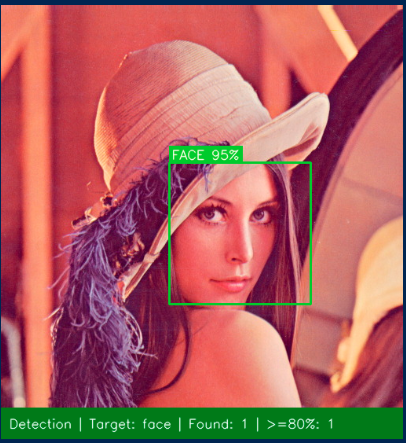
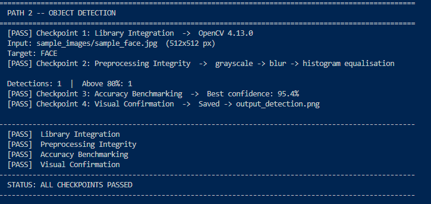

# 🔍 Image & Text Recognition Pipeline
> **Task 4 — Isha Javed**  
> A Python pipeline for OCR and Object Detection with confidence-based filtering and annotated visual output.

---

## 📌 Overview

This project implements two independent recognition pipelines:

| Path | Mode | Technology |
|------|------|------------|
| **Path 1** | OCR — Optical Character Recognition | Tesseract (CNN + LSTM) |
| **Path 2** | Object Detection | OpenCV Haar Cascade Classifiers |

Both paths apply image pre-processing before inference and **only accept results with a confidence score ≥ 80%**.

---

## 🧪 Sample Results

### Path 1 — OCR

| Input | Output |
|-------|--------|
|  |  |

**Terminal:**  


---

### Path 2 — Object Detection

| Input | Output |
|-------|--------|
|  |  |

**Terminal:**  


---

## 📁 Project Structure

```
Task-4-Isha_Javed/
├── recognition.py          # Main script
├── README.md
├── Images/                 # Sample results (input, output, terminal screenshots)
│   ├── simple_text.png
│   ├── simple_text_output.png
│   ├── simple_text_terminal.png
│   ├── face.png
│   ├── face_output.png
│   └── face_terminal.png
└── sample_images/          # Test images to run the pipeline on
    ├── sample_text_simple.png
    ├── sample_invoice.png
    ├── sample_numberplate.png
    ├── sample_notes.png
    ├── sample_report.png
    ├── sample_face.jpg
    └── sample_faces_group.jpg
```

---

## ⚙️ Requirements

### Python Libraries

```bash
pip install pytesseract opencv-python pillow numpy
```

### Tesseract OCR Engine

> Required for Path 1 only.

**Windows**
1. Download the installer from: https://github.com/UB-Mannheim/tesseract/wiki
2. Run the `.exe` installer (64-bit recommended)
3. In `recognition.py`, uncomment **line 6** and set the path:
   ```python
   pytesseract.pytesseract.tesseract_cmd = r"C:\Program Files\Tesseract-OCR\tesseract.exe"
   ```

**Linux**
```bash
sudo apt install tesseract-ocr
```

**macOS**
```bash
brew install tesseract
```

**Verify installation:**
```bash
tesseract --version
```

---

## 🚀 Usage

### Path 1 — OCR

```bash
python recognition.py --path 1 --image <image_file>
python recognition.py --path 1 --image <image_file> --psm <mode>
python recognition.py --path 1 --image <image_file> --output result.png
```

**Examples:**
```bash
python recognition.py --path 1 --image sample_images/sample_text_simple.png
python recognition.py --path 1 --image sample_images/sample_invoice.png --psm 11
python recognition.py --path 1 --image sample_images/sample_numberplate.png --psm 7
python recognition.py --path 1 --image sample_images/sample_notes.png
python recognition.py --path 1 --image sample_images/sample_report.png
```

---

### Path 2 — Object Detection

```bash
python recognition.py --path 2 --image <image_file>
python recognition.py --path 2 --image <image_file> --target <target>
python recognition.py --path 2 --image <image_file> --output result.png
```

**Examples:**
```bash
python recognition.py --path 2 --image sample_images/sample_face.jpg
python recognition.py --path 2 --image sample_images/sample_faces_group.jpg
python recognition.py --path 2 --image sample_images/sample_face.jpg --target eye
```

---

## 🔧 Arguments

| Argument | Required | Default | Description |
|----------|----------|---------|-------------|
| `--path` | ✅ | — | `1` = OCR, `2` = Object Detection |
| `--image` | ✅ | — | Path to input image (JPG, PNG, BMP) |
| `--psm` | ❌ | `6` | Page Segmentation Mode — Path 1 only |
| `--target` | ❌ | `face` | Detection target — Path 2 only |
| `--output` | ❌ | auto | Custom output filename |

---

## 📄 PSM Modes — Path 1 Only

| Mode | Description | Best For |
|------|-------------|----------|
| `--psm 3` | Fully automatic layout detection | Mixed or unknown layouts |
| `--psm 6` | Single uniform block of text *(default)* | Clean documents, paragraphs |
| `--psm 7` | Single line of text | Number plates, headers, labels |
| `--psm 11` | Sparse scattered text | Invoices, receipts |

---

## 🎯 Detection Targets — Path 2 Only

| Target | Description |
|--------|-------------|
| `face` | Front-facing face *(default)* |
| `eye` | Eyes |
| `upperbody` | Head and shoulders |
| `fullbody` | Full standing body |
| `smile` | Smile |

---

## 🔬 How It Works

### Path 1 — OCR Pipeline

```
Load Image → Pre-Processing → Tesseract OCR → Confidence Filtering → Annotated Output
```

| Step | Detail |
|------|--------|
| **1. Load Image** | Input image loaded via OpenCV |
| **2. Grayscale** | Removes colour, enhances text contrast |
| **3. Gaussian Blur** | Smooths noise before thresholding |
| **4. Otsu Thresholding** | Converts to pure black & white |
| **5. Deskewing** | Detects and corrects tilted text |
| **6. OCR** | Tesseract (CNN + LSTM) extracts characters |
| **7. Confidence Filter** | Average word confidence must be ≥ 80% |
| **8. Output** | Annotated image saved with per-word bounding boxes |

---

### Path 2 — Object Detection Pipeline

```
Load Image → Pre-Processing → Haar Cascade Detection → Confidence Filtering → Annotated Output
```

| Step | Detail |
|------|--------|
| **1. Load Image** | Input image loaded via OpenCV |
| **2. Grayscale** | Prepares image for feature extraction |
| **3. Gaussian Blur** | Reduces noise |
| **4. Histogram Equalisation** | Improves contrast for better detection |
| **5. Haar Cascade** | Pre-trained classifier scans at multiple scales, returns (X, Y, W, H) |
| **6. Confidence Scoring** | Neighbour count mapped to percentage; detections below 80% discarded |
| **7. Output** | Bounding boxes drawn with label and confidence score |

---

## 📊 Output

All results are saved in the directory where the script is run.

| Path | Default Output File |
|------|---------------------|
| Path 1 — OCR | `output_ocr.png` |
| Path 2 — Detection | `output_detection.png` |

**Colour coding:**

| Colour | Meaning |
|--------|---------|
| 🟩 Green | Confidence ≥ 80% — accepted |
| 🟥 Red | Confidence < 80% — below threshold |

---

## ✅ Validation Checkpoints

All four checkpoints must pass for a successful run.

| # | Checkpoint | Description |
|---|------------|-------------|
| 1 | **Library Integration** | `pytesseract` / OpenCV loaded and Tesseract is accessible |
| 2 | **Pre-Processing Integrity** | Grayscale and thresholding applied successfully |
| 3 | **Accuracy Benchmarking** | Confidence score meets the 80% minimum threshold |
| 4 | **Visual Confirmation** | Output image saved successfully |

---

## 🛠️ Troubleshooting

**`Tesseract not found`**  
Tesseract is not installed or Python cannot locate it. On Windows, uncomment and update the path on line 6 of `recognition.py`.

**`Cannot open image`**  
The image path is incorrect. Run the command from inside the `Task-4-Isha_Javed/` folder, or provide the full absolute path.

**`Low OCR accuracy`**  
Try a different `--psm` mode. Use `--psm 11` for invoices and receipts, `--psm 7` for single-line text. Ensure the image is clear, well-lit, and not heavily compressed.

**`No detections found (Path 2)`**  
Use a high-resolution, front-facing photo. Try switching `--target` if the default `face` classifier is not appropriate for the subject.

---

> Built by **Isha Javed**